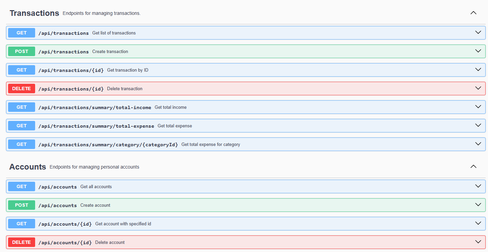
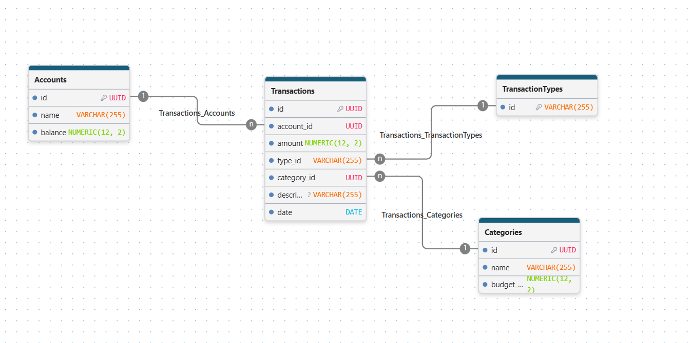

# Personal Budget App
A Spring Boot-based RESTful API designed for tracking personal finances, accounts, and transactions with automated metrics calculation.

## Tech stack/requirements
- **Java** 17+, **Spring Boot**
- **PostgreSQL** (containerized using **Docker**)
- API documentation: **SwaggerUI**
- Build tool: **Gradle**
## Quick start
1. Download the repository: `git clone https://github.com/krzysztof-kopel/BudgetApp`
2. Run the database `docker-compose up -d`
3. Run the application `./gradlew bootRun`
4. See the SwaggerUI documentation at [http://localhost:8080/swagger-ui/index.html](http://localhost:8080/swagger-ui/index.html)

## Features
- Creating, deleting and querying accounts.
- Creating, querying and deleting transactions, which be can be either an income or an expense.
- Grouping transactions through categories (currently only predefined ones, available in `src/main/resources/data.sql`).
- Presenting statistics about expenses and incomes, including filtering by date and category.

## Note on AI usage
I used agentic AI for helping me write tests and for consultation when I didn't know/wasn't sure about something. I always double-checked the generated code.

## Database schema
Database schema is available in `src/main/resources/schema.sql` and on the picture below.
